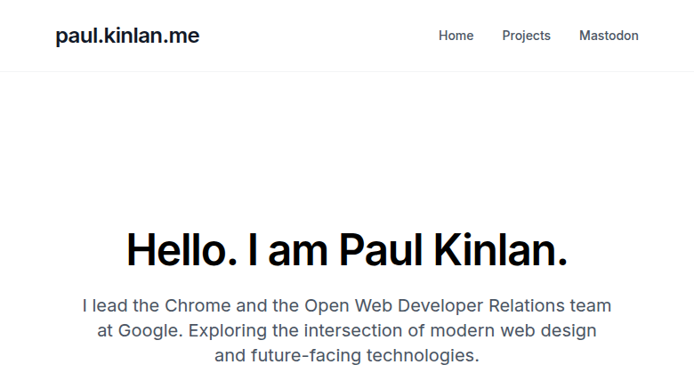
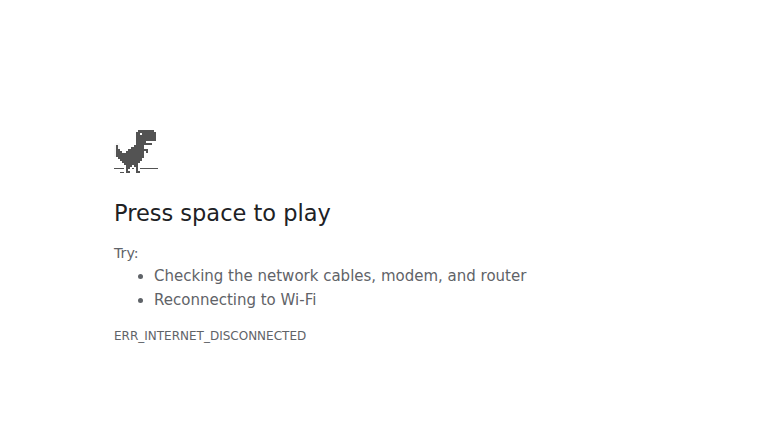

# web-uplift compare: paul_kinlan_me

- **Before:** 2026-10-06T13-17-07-499Z (baseline run under modern-web-guidance@0.0.172)
- **After:** 2026-10-08T14-10-00-000Z (post-reanalysis run under modern-web-guidance@0.0.193)
- **Outstanding issue-findings:** 26 -> 26 (0)
- **Unconcluded checks (blocked/not-run):** 0 -> 0 (0)
- **Resolved:** 0 | **New:** 0 | **Persisting:** 26

## Principle status changes
_No principle status changed between the two runs._

## Findings
**Resolved (0)**
- none

**Newly introduced (0)**
- none

**Persisting (26)**
- F01 (high) The newest full post's eight demo videos, their posters and the demo embed script/stylesheet are all missing in production, so every demo renders as an empty grey box. _[primary-flow-completion]_
- F02 (high) The article logs 19 console errors from first-party failed loads and strict-MIME refusals. _[no-console-errors]_
- F03 (medium) Every page downloads the full Material Symbols variable font (1.14 MB) to draw four icons, behind two render-blocking cross-origin Google Fonts stylesheets. _[efficient-resource-delivery]_
- F04 (medium) Listing pages ship full-size legacy PNG/JPEG hero images with no srcset, no lazy loading and no dimensions. _[optimised-assets]_
- F05 (medium) Analytics scripts dominate the main thread on mobile, producing ~1.4 s of Total Blocking Time on a static text page. _[efficient-main-thread]_
- F06 (medium) A sunset Universal Analytics snippet (UA-114468-20) still loads and fires a pageview alongside GA4 and Vercel Insights on every page. _[trim-unused-and-duplicate-code]_
- F07 (medium) No dark mode: the site pins color-scheme: light and ignores prefers-color-scheme, while a non-standard meta tag claims 'light dark' support. _[respects-color-scheme]_
- F08 (medium) Cross-document view transitions and the article's autoplaying looping videos ignore prefers-reduced-motion. _[respects-reduced-motion]_
- F09 (medium) Long inline code runs push the article 221 px wider than a 360 px phone, so the whole post renders zoomed out on mobile. _[responsive-no-horizontal-scroll]_
- F10 (low) The post card is reused across the home feed, curated card, tag and project listings but only responds to viewport breakpoints. _[component-level-responsiveness]_
- F11 (medium) Icon-font ligature names are read aloud: links are announced as 'READ ARTICLE arrow_forward' and the footer announces 'alternate_email', 'rss_feed', 'mail'. _[names-roles-labels]_
- F12 (low) Heading levels skip (H1 -> H3/H4) on home and article, and there is no skip-to-content link. _[structure-and-focus]_
- F13 (medium) The article fails 320/360 px reflow and its eight looping autoplay videos have no pause control and no text alternative. _[zoom-reflow-targets-and-media]_
- F14 (low) Listing images and the byline avatar lack intrinsic dimensions, and every <head> carries obsolete meta tags. _[sound-document-and-assets]_
- F15 (low) The Permissions-Policy header lists unrecognised features, logging a warning on every page. _[browser-platform-hygiene]_
- F16 (low) Thousands of tag and section pages share one generic, outdated meta description. _[title-and-description]_
- F17 (low) The homepage describes itself as a NewsArticle, and listing pages expose no Blog/CollectionPage entity. _[structured-and-shareable-metadata]_
- F18 (medium) CSP allows 'unsafe-inline' scripts with a host allowlist, and analytics cookies are set without Secure. _[secure-transport-and-headers]_
- F19 (medium) Three analytics systems track each visit, and Google Analytics sets 400-day identifiers on first load with no notice or consent. _[data-minimisation-and-third-parties]_
- F20 (medium) Dead links land on Vercel's generic 404 page with no way back into the site. _[clear-system-state-and-recovery]_
- F21 (low) The manifest invites installation as a standalone app, but there is no service worker or offline fallback, so an installed copy opens to the browser's offline error. _[offline-and-installable]_
- F23 (low) Publication times are emitted without a time zone: <time> has no datetime and JSON-LD dates lack an offset. _[time-zone-correctness]_
- F24 (low) The newsletter email field has no autocomplete token, so browsers will not reliably offer the user's address. _[trustworthy-input-assistance]_
- F25 (medium) 96% of the homepage's bytes are third-party (fonts and analytics), and the article is built to autoplay eight looping videos at once. _[third-party-and-media-budget]_
- F26 (low) Each page view does work that produces nothing: a hit to a discontinued UA property and a full cache/service-worker teardown. _[no-wasteful-work]_
- F27 (low) A fixed reading-progress bar is shipped on every page but never moves. _[scroll-state-aware-chrome]_

## Captured screenshots (run 2026-10-08T14-10-00-000Z)

All images below are preserved locally under `evidence-out/web-uplift-24o/evidence/`:

| View | Mode / Condition | Image |
| --- | --- | --- |
| Homepage (rendered) | Desktop viewport (1280x900) |  |
| Homepage (crawler view) | JavaScript disabled |  |
| Homepage (first viewport) | Light default (1280x900) |  |
| Homepage (dark mode) | prefers-color-scheme: dark |  |
| Homepage (offline resilience) | Network offline reload |  |
