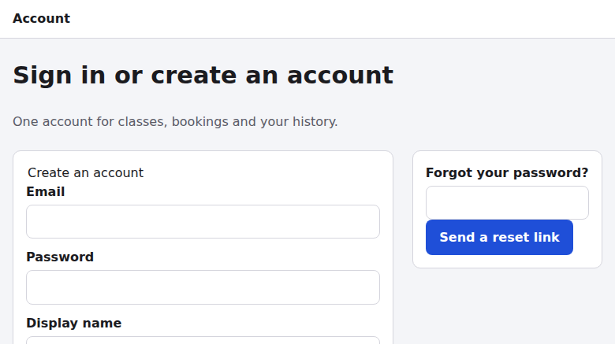
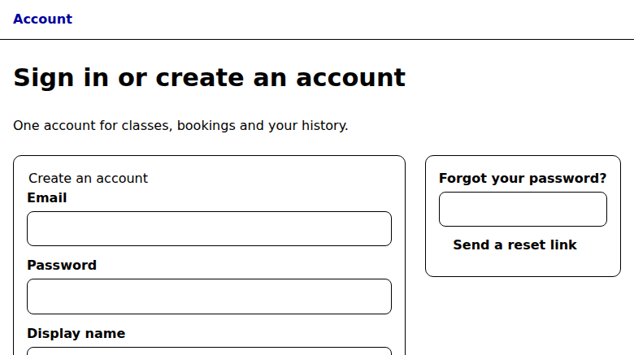

# Web audit: http://127.0.0.1:8765/account-recovery/

- **Run:** `2026-10-09T00-17-28-543Z`, report mode, agent: claude
- **Status:** completed. Atomic coverage is **58 / 58** checks judged, with 0 blocked, 0 not-run, 0 missing, 0 unknown and 0 duplicates. The validator reports `complete: true`.
- **Catalogue:** modern-web-guidance@0.0.193 (`sha256:5cb6b09a…82b7`). Baseline oracle: web-features@3.40.0.
- **Config:** no `web-uplift.json` was found. Applicability was judged from recon.

## Page profile

This is a static MPA account entry page (36 elements, **0 scripts**, one shared 3 KB stylesheet `../base.css`). It is served by a Python `http.server` fixture over HTTP/1.0.

- `<title>`: "Your account". h1: **"Sign in or create an account"**.
- `#signup-form` has a "Create an account" fieldset with Email (`autocomplete=username`), Password (`new-password`) and Display name. It POSTs to `/signup`.
- `#reset-form` has one email field labelled "Forgot your password?". It POSTs to `/reset`.
- **There is no sign-in form.** The page has no `current-password` field and no sign-in link, and `/signin` and `/login` return 404.
- The nav has one link, "Account" (`aria-current=page`), which points to `/`, a raw directory listing.

Server-side behaviour (the 501s on POST, the missing headers) reflects this fixture host and may differ in production. Those findings carry medium confidence.

### Paths covered

| Path | Why |
|---|---|
| account-load | The only page this target exposes: the auth/account-form archetype, desktop |
| account-narrow | 360x800 layout plus a throttled mobile trace (mobile-lighthouse, 4x CPU) |
| account-preferences | Dark scheme; forced colours with more contrast |
| account-submit | Empty and filled submits of both forms; POST /signup and /reset; 10x interaction for the heap check |
| returning-user | Looking for a way to sign in (DOM plus /signin, /login, /.well-known/change-password) |
| header-nav | The nav target `/` |
| account-i18n | ar-EG locale with the Asia/Tokyo time zone |

**Not covered:** sibling fixture directories (`booking/`, `catalogue/`, `contact-lead/`, `event-registration/`). They are separate designs and are not linked from this page. `booking/` was audited separately in run `2026-10-09T00-06-22-914Z`.

## Evidence gathered

The primitives used were dom, screenshot (default, dark, 360x800, forced-colors), axe-core 4.13.0, a11ytree (AX tree plus real Tab walk), targets (1280 and 360), features (CSSOM census), layout (360), trace (throttled mobile), har plus summary, headers, cookies, trackers, secrets, discoverability (raw vs rendered, crawler pair), resilience (offline reload), heap (baseline and after 10x), console (on every primitive) and evaluate probes (forms, endpoints, metadata, doctype, i18n render).

I also consulted Modern Web Guidance: autofill-sign-up-form (retrieved), plus the search hits autofill-sign-in-form, passkey-authentication and passkey-reauthentication. Baseline statuses were checked with `knowledge/baseline.mjs`.

| Artifact | What it shows |
|---|---|
| [evidence/dom.json](evidence/dom.json) | Full HTML (1497 chars) and CSS (3143 chars), untruncated |
| [evidence/desktop.png](evidence/desktop.png) | Default capture |
| [evidence/dark.png](evidence/dark.png) | `prefers-color-scheme: dark`, identical to the default |
| [evidence/narrow-360.png](evidence/narrow-360.png) | 360x800, one column, no overflow |
| [evidence/forced-colors.png](evidence/forced-colors.png) | Forced colours: buttons lose their edge |
| [evidence/axe.json](evidence/axe.json) | 0 violations, 33 passes |
| [evidence/a11ytree.json](evidence/a11ytree.json) | Reset textbox named "Forgot your password?"; 7 page tab stops, all with outlines |
| [evidence/targets.json](evidence/targets.json) | 0 of 7 targets under 24px at either size |
| [evidence/features.json](evidence/features.json) | Complete census: no color-scheme, :user-invalid, @container or @view-transition |
| [evidence/layout-360.json](evidence/layout-360.json) | Overflow 0, CLS 0 |
| [evidence/trace-mobile.json](evidence/trace-mobile.json) / [summary](evidence/trace-mobile-summary.json) | LCP 511ms, TBT 101ms (throttled, script-free) |
| [evidence/page.har](evidence/page.har) / [summary](evidence/page-summary.json) | 3 requests, 5.4 KB, 0 third-party; base.css uncompressed and uncached |
| [evidence/headers.json](evidence/headers.json) | HTTP; all six security headers missing |
| [evidence/cookies.json](evidence/cookies.json) | 0 cookies |
| [evidence/trackers.json](evidence/trackers.json) | 0 third parties |
| [evidence/secrets.json](evidence/secrets.json) | 0 findings |
| [evidence/discoverability.json](evidence/discoverability.json) + [rendered](evidence/discoverability-rendered.png) / [crawler](evidence/discoverability-crawler.png) | 100% raw coverage; no meta description |
| [evidence/resilience.json](evidence/resilience.json) + [offline](evidence/resilience-offline.png) | No manifest or service worker; offline served from HTTP cache |
| [evidence/heap-baseline.json](evidence/heap-baseline.json) / [after 10x](evidence/heap-after-10x.json) | 29.7k to 31.7k nodes, 0 Detached* |
| [evidence/form-probe.json](evidence/form-probe.json) | Field attributes, the 501s and 404s, nav, metadata |
| [evidence/doc-probe.json](evidence/doc-probe.json) | Doctype, http/1.0, 36 elements, PublicKeyCredential unused |
| [evidence/i18n-ar-EG-tokyo.json](evidence/i18n-ar-EG-tokyo.json) | Identical render under ar-EG / Tokyo |

## Principle outcomes (derived from check outcomes)

| Principle | Status | Findings |
|---|---|---|
| respect-user-preferences | issues | F10, F11 |
| implement-natural-interactions | issues | F15 |
| provide-guided-navigation | issues | F8, F1 |
| maximize-content-reduce-noise | pass | |
| adapt-to-the-form-factor | pass | |
| support-core-task-success | issues | F1, F2, F6 |
| be-fast-and-stable | issues | F13 |
| be-inclusive | issues | F4, F8, F12 |
| follow-best-practices | pass | |
| be-discoverable | issues | F14 |
| be-private-and-secure | issues | F3, F5, F9 |
| be-resilient (contextual) | issues | F2 |
| be-internationalised (contextual) | pass (2 of 3 checks N/A: no locale or time data) | |
| be-trustworthy | issues | F1, F2, F5, F6, F7 |
| be-sustainable (contextual) | pass | |
| be-agent-ready (contextual) | not-applicable (no agent-facing intent) | |
| be-memory-efficient | pass | |

Check tally: 18 issues, 30 pass, 10 not-applicable.

## Findings

### support-core-task-success

**F1 (critical, high confidence): a returning user cannot sign in.** The h1 promises "Sign in or create an account", but there is only a sign-up form and a reset form. There is no `current-password` field and no sign-in link, and `/signin` and `/login` return 404. Existing users are funnelled into creating a duplicate account. The fix is a dedicated sign-in form placed first, with `autocomplete="username webauthn"` on the email and `current-password` on the password (MWG `autofill-sign-in-form`).

**F2 (high, medium confidence): both flows dead-end.** A valid POST to `/signup` or `/reset` returns **501 Unsupported method**, a raw server error page with no confirmation and no retry, and the input is lost. The fix is POST-redirect-GET to a "verify your email" page and to a neutral "if an account exists, we emailed a link" page. On failure, re-render with the input preserved and a `role=alert` summary.

### be-private-and-secure

**F3 (high, medium confidence):** the password form is served and posted over **plain HTTP** with no CSP and no `nosniff`. Meanwhile the footer claims "Your account is protected by a session cookie." Loopback counts as a secure context, which is why confidence is medium.

**F5 (medium):** authentication is password-only. There are no passkeys or WebAuthn (`PublicKeyCredential` exists but is never used), and no `/.well-known/change-password` endpoint (MWG `passkey-registration`, `passkey-authentication`). WebAuthn is Baseline widely available, so no fallback is required.

**F9 (medium):** there is no HSTS, no frame-ancestors or X-Frame-Options, no Referrer-Policy and no Permissions-Policy. Clickjacking is a real risk on a credential form.

### be-inclusive

**F4 (medium):** the reset textbox's accessible name is **"Forgot your password?"**, a question rather than "Email", and the reset form has no heading or name. axe passes it because a label exists; the a11y tree shows the problem.

**F12 (low):** `body { font: 16px/1.5 … }` pins body and control text, which ignores the user's text-size preference (MWG `respect-os-text-scale`).

### be-trustworthy

**F6 (medium):** validation relies on native bubbles only. There is no `:user-invalid` styling, no hints or password rule, no `aria-describedby` and no live region (MWG `validate-input-after-interaction`).

**F7 (medium):** several sign-up input-assistance gaps. There is no Show-password toggle, no stated password rule or `minlength`, no autocomplete token on Display name (use `nickname`), and no `spellcheck="false"` on the email identifiers. Using `autocomplete="username"` on the email is correct per MWG `autofill-sign-up-form`.

### provide-guided-navigation

**F8 (medium):** the only nav link, "Account", carries `aria-current="page"` but points to `/`, a directory listing. The current-page cue is wrong, and there are no real destinations (Classes, Bookings).

### respect-user-preferences

**F10 (medium):** there is no dark mode. The capture under `prefers-color-scheme: dark` is identical to the default, with no `color-scheme` and no media query (MWG `dark-mode`).

**F11 (low):** in forced-colours mode, buttons with `border: 0` lose their boundary and read as bare text. A `border: 2px solid transparent` fixes it.

### Lower severity

- **F13 (be-fast-and-stable, low):** base.css is uncompressed, has no Cache-Control and is served over HTTP/1.0. The absolute cost is small.
- **F14 (be-discoverable, low):** the title "Your account" is generic and there is no meta description.
- **F15 (implement-natural-interactions, low):** there is no cross-document `@view-transition` opt-in.

## Prioritised task list

1. **T1:** add a real sign-in form first on the page (F1, `autofill-sign-in-form`).
2. **T2:** back `/signup` and `/reset` with POST handlers using PRG, neutral reset copy and input-preserving errors (F2, `forms`).
3. **T3:** HTTPS plus an enforced CSP (object-src 'none', frame-ancestors 'none', form-action 'self'), nosniff, HSTS, Referrer-Policy, Permissions-Policy, and a `__Host-` Secure HttpOnly session cookie (F3, F9, `security`).
4. **T4:** give the recovery form a heading, an "Email" label and a hint (F4, `accessibility`).
5. **T5:** add a show-password toggle, a password rule with `minlength`, `autocomplete="nickname"` and `spellcheck="false"` (F7, `autofill-sign-up-form`).
6. **T6:** add `:user-invalid` styling, inline errors and `aria-describedby` hints (F6, `validate-input-after-interaction`).
7. **T7:** offer passkeys and serve `/.well-known/change-password` (F5, `passkey-registration`).
8. **T8:** fix the nav: correct `aria-current` and real destinations (F8).
9. **T9:** add dark mode with `color-scheme` and token overrides (F10, `dark-mode`).
10. **T10:** give buttons a transparent border for forced colours (F11).
11. **T11:** use a relative body font size (F12, `respect-os-text-scale`).
12. **T12:** write a descriptive title and meta description (F14).
13. **T13:** compress and long-cache base.css (F13, `performance`).
14. **T14:** add cross-document view transitions behind reduced-motion (F15, `cross-document-transitions`).

## Judgement notes and low-confidence items

- The a11ytree reported one focus stop without an indicator. It is the `<body>` wrap at the end of the cycle, not a control, so `structure-and-focus` passes.
- The heap grew by 2.0k nodes (+100 KB) over 10 interaction cycles. On a zero-script page that is the harness's injected script plus native validation UI. There were no Detached* nodes. Confidence is medium.
- The features census lists `margin-left`/`margin-right` and similar properties. These are expansions of symmetric `margin`/`padding` shorthands, not authored physical properties, so `lang-dir-and-logical-properties` passes.
- `data-minimisation-and-third-parties` passes at medium confidence. The display name has no stated purpose, but it is self-chosen and non-identifying.
- `offline-and-installable` is N/A because account creation and recovery are intrinsically online.
- `be-agent-ready` is N/A because there is no declared agent surface and credential entry is a human/password-manager step.
