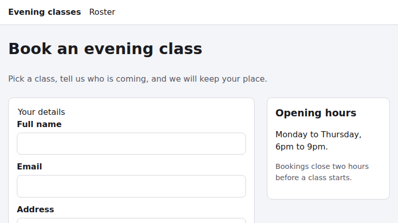
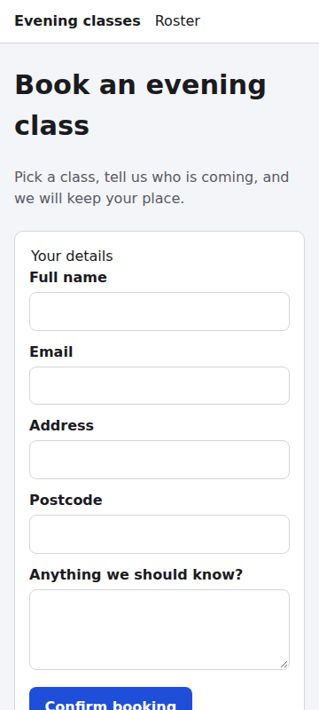
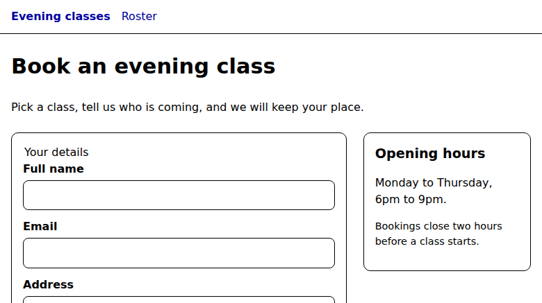

# Web audit: http://127.0.0.1:8765/booking/

- **Run:** 2026-10-09T00-06-22-914Z · mode: report (critique only) · status: **completed**
- **Coverage:** 58 / 58 checks judged (catalog `modern-web-guidance@0.0.193`, `sha256:5cb6b09a…82b7`). 0 blocked, 0 not-run, 0 missing, 0 unknown, 0 duplicates. The validator reports `complete: true`.
- **Config:** no `web-uplift.json` found, so applicability was judged by the auditor.

## Page profile

A static MPA "Evening class booking" page for *Riverside Training Centre*:

- one shared stylesheet (`../base.css`, 3 KB)
- **zero scripts**
- 40 DOM elements
- a native `<form method=post action=/book>` with name, email, address, postcode, notes and "Confirm booking"

The host is a Python `http.server` fixture (HTTP/1.0, a directory listing at `/`). Sibling fixture designs (`account-recovery/`, `catalogue/`, `contact-lead/`, `event-registration/`) are not linked from this page and are out of scope.

### Paths exercised

| id | what | conditions | result |
|---|---|---|---|
| booking-load | initial load | default desktop; 1280x720 for targets | issues |
| booking-narrow | mobile layout + throttled trace | 360x800, mobile-lighthouse, 4x CPU | pass |
| booking-preferences | user preferences | dark; forced-colors + more contrast | issues |
| booking-submit | empty submit, filled POST to /book, 10x fill/validate | form interaction | failed |
| header-nav | nav link targets `/` and `/roster` | fetch | issues |
| booking-i18n | second locale/zone | ar-EG, Asia/Tokyo | pass |

## Evidence gathered

- **Page structure:** dom
- **Screenshots:** default, dark, 360px, forced colours
- **Accessibility:** axe-core 4.13.0, a11ytree (AX tree + real Tab walk), targets (both form factors)
- **CSS:** features (live CSSOM census, complete)
- **Performance:** layout at 360px, trace (throttled mobile), HAR + summary
- **Security and privacy:** headers, cookies, trackers, secrets
- **Crawlability:** discoverability (raw vs rendered, JS-off screenshot)
- **Resilience:** service worker, manifest, offline reload
- **Memory:** heap summaries (baseline, and after 10x interaction)
- **Ad-hoc `evaluate` probes:**
  - recon of sibling routes
  - form fields, validation and POST
  - ar-EG / Tokyo render
- **Modern Web Guidance:** autofill-address-form, autofill-sign-up-form, validate-input-after-interaction, dark-mode, security, privacy

| Default | Dark (identical) | 360px | Forced colours |
|---|---|---|---|
|  |  |  |  |

### Artifacts

| type | path | caption |
|---|---|---|
| dom | [evidence/dom-booking.json](evidence/dom-booking.json) | Rendered HTML and full CSS |
| other | [evidence/recon.json](evidence/recon.json) | `/` is a directory listing; `/roster`, `/book`, robots, sitemap, manifest are 404 |
| other | [evidence/form-probe.json](evidence/form-probe.json) | Field attributes, validation, POST /book → 501, aria-current, meta |
| other | [evidence/axe.json](evidence/axe.json) | 0 violations, 33 passes |
| other | [evidence/a11ytree.json](evidence/a11ytree.json) | AX tree + 8 visible-focus Tab stops |
| other | [evidence/targets.json](evidence/targets.json) | 0/7 targets under 24px at both sizes |
| other | [evidence/features.json](evidence/features.json) | No color-scheme, @container, :user-invalid, @view-transition, motion |
| layout | [evidence/layout-360.json](evidence/layout-360.json) | 0px overflow, CLS 0 |
| trace / summary | [evidence/trace-mobile.json](evidence/trace-mobile.json) · [summary](evidence/trace-mobile-summary.json) | LCP 1340ms throttled mobile |
| har / summary | [evidence/booking.har](evidence/booking.har) · [summary](evidence/booking-summary.json) | 3 requests, 5.5 KB, 0 third-party; base.css uncached and uncompressed |
| other | [evidence/headers.json](evidence/headers.json) | HTTP; all six security headers missing |
| other | [evidence/cookies.json](evidence/cookies.json) · [trackers](evidence/trackers.json) · [secrets](evidence/secrets.json) | 0 cookies, 0 trackers, 0 secrets |
| discoverability | [evidence/discoverability.json](evidence/discoverability.json) | 100% raw-HTML coverage; [rendered](evidence/discoverability-rendered.png) / [crawler](evidence/discoverability-crawler.png) |
| other | [evidence/resilience.json](evidence/resilience.json) · [offline png](evidence/resilience-offline.png) | No manifest or SW; offline served from HTTP cache |
| heap | [baseline](evidence/heap-baseline.json) · [after 10x](evidence/heap-after-10x.json) | 0.97 → 1.22 MB, no Detached* |
| other | [evidence/i18n-ar-EG-tokyo.json](evidence/i18n-ar-EG-tokyo.json) | Text unchanged; lang=en, ltr, 0 physical props |
| screenshot | [evidence/booking-after-submit.png](evidence/booking-after-submit.png) | **Inconclusive.** It shows the pre-submit form, so it is not used as evidence. |

## Principle outcomes

| Principle | Expectation | Outcome |
|---|---|---|
| respect-user-preferences | default | **issues** (F4) |
| implement-natural-interactions | default | **issues** (F14); 2 checks N/A |
| provide-guided-navigation | default | **issues** (F7, F6); 2 checks N/A |
| maximize-content-reduce-noise | default | pass |
| adapt-to-the-form-factor | default | pass |
| support-core-task-success | default | **issues** (F1, F2, F5) |
| be-fast-and-stable | default | **issues** (F12) |
| be-inclusive | default | **issues** (F6, F13) |
| follow-best-practices | default | pass |
| be-discoverable | default | **issues** (F11); structured data N/A |
| be-private-and-secure | default | **issues** (F8, F9, F10) |
| be-resilient | contextual | **issues** (F2); offline/installable N/A |
| be-internationalised | contextual | pass (locale data and time zone N/A) |
| be-trustworthy | default | **issues** (F1, F3, F5) |
| be-sustainable | contextual | pass |
| be-agent-ready | contextual | not-applicable (opportunity: a WebMCP booking tool once the flow works) |
| be-memory-efficient | default | pass |

## Findings by principle

### support-core-task-success

- **F1 · high · primary-flow-completion: you cannot choose a class.**
  - **What's wrong:** The lede says "Pick a class…", but the form has no class field (`hasClassPicker=false`). "Confirm booking" commits to an unspecified class.
  - **Also affects:** be-trustworthy / safe-commercial-and-account-flows, because the commitment is never shown.
  - **Fix:** Add a native `<select required>` or a radio `<fieldset>` of sessions, and echo the choice back before confirming. *(MWG: forms)*
- **F2 · high · primary-flow-completion: submission dead-ends.**
  - **What's wrong:** POST `/book` → **501 Unsupported method** (GET → 404). The user lands on the host's raw error page with no retry and no confirmation.
  - **Also affects:** clear-system-state-and-recovery and be-resilient / network-and-http-failure-states.
  - **Confidence:** medium, because this is a fixture host.
  - **Fix:** A POST handler that redirects to a confirmation page (POST-redirect-GET). On failure, re-render the form with input preserved and an alert summary.

### be-trustworthy

- **F3 · medium · trustworthy-input-assistance: wrong autofill token on the email field.**
  - **What's wrong:** `<input type=email autocomplete="username">` on a booking form with no account or password.
  - **Why it's wrong:** MWG *autofill-address-form* specifies `autocomplete="email"` for contact email. The *autofill-sign-up-form* advice to use `username` for email applies only to credential forms. With `username`, the browser may offer saved login identifiers instead of the user's contact email.
  - **Fix:** Use `autocomplete="email" spellcheck="false"`. Optionally make the street address a `<textarea autocomplete="street-address">`.
- **F5 · medium · humane-error-handling: no visible error state.**
  - **What's wrong:** Errors rely only on transient native bubbles. There are 0 `:user-invalid`/`aria-invalid` rules, no hints linked by `aria-describedby`, and no live or alert region.
  - **Fix:** Add `input:user-invalid` styling plus inline messages, per MWG *validate-input-after-interaction* (Baseline widely available since 2023-11-02).

### respect-user-preferences

- **F4 · medium · respects-color-scheme: no dark mode.** The dark capture is byte-identical to the light one, and the CSSOM has no `color-scheme`, `light-dark()` or `prefers-color-scheme`.
  - **Fix:** `color-scheme: light dark` plus `light-dark()` tokens, with a `@media (prefers-color-scheme: dark)` fallback because `light-dark()` is only newly available. *(MWG: dark-mode)*

### be-inclusive

- **F6 · medium · names-roles-labels: wrong current-page state.** `aria-current="page"` sits on the "Evening classes" link (`/`) while the user is on `/booking/`. Assistive technology announces the wrong page as current. axe does not catch this.
- **F13 · low · legible-text: fixed body font size.** `body { font: 16px/1.5 … }` pins body and control text at 16px, ignoring the user's default text size. Use `100%` or `1rem`. *(MWG: respect-os-text-scale)*

All other inclusive checks pass with direct evidence:

- axe: 0 violations
- labelled textboxes and proper landmarks
- visible focus on all 8 Tab stops
- 0 undersized targets
- contrast at least ~6.2:1

### provide-guided-navigation

- **F7 · medium · directs-attention: nav links go nowhere useful.** "Roster" is a 404 and "Evening classes" opens a raw directory listing. Together with F6, the nav misleads users about where they are.

### be-private-and-secure

- **F8 · medium · secure-transport-and-headers:** A PII form (name, email, address) served over plain HTTP with no CSP and no `nosniff`. Confidence is medium because this is a fixture host.
- **F9 · low · data-minimisation:** Street address and postcode are *required* to book a class, with no stated purpose. Otherwise the page is exemplary: 0 cookies, 0 third parties, 0 trackers, 0 scripts.
- **F10 · low · defensive-browser-policies:** No HSTS, no `frame-ancestors` or X-Frame-Options, no Referrer-Policy, no Permissions-Policy.

### be-fast-and-stable

- **F12 · low · efficient-resource-delivery:** `base.css` (the only render-blocking resource) is uncompressed, has no Cache-Control, and is served over HTTP/1.0.

Core Web Vitals are good: LCP 1.34 s on throttled mobile, CLS 0. The trace shows 8 long tasks (TBT 1172 ms), but the page has no scripts, so these are renderer startup and parse under 4x CPU. Unthrottled, there are 0 long tasks.

### be-discoverable

- **F11 · low · title-and-description:** There is no meta description. The title is good, and the raw HTML covers 100% of the rendered content.

### implement-natural-interactions

- **F14 · low · view-transitions:** There is no `@view-transition { navigation: auto }` for the MPA navigations. Gate it behind `prefers-reduced-motion: no-preference`.

## Prioritised task list

1. **T1:** Add a class choice to the form and show it before confirming *(F1, forms)*
2. **T2:** Implement the `/book` POST handler, a confirmation page, and an error re-render that preserves input *(F2, forms)*
3. **T3:** Set `autocomplete="email"` on the email field; consider a textarea for street-address *(F3, autofill-address-form)*
4. **T4:** Add `:user-invalid` styling, inline errors, and hints linked by `aria-describedby` *(F5, validate-input-after-interaction)*
5. **T5:** Correct `aria-current` and repair the nav targets *(F6, F7)*
6. **T6:** Serve over HTTPS with an enforced CSP, nosniff, HSTS, Referrer-Policy and Permissions-Policy *(F8, F10, security)*
7. **T7:** Add dark mode via `color-scheme` and `light-dark()` *(F4, dark-mode)*
8. **T8:** Drop the required address and postcode, or explain why they are needed *(F9, privacy)*
9. **T9:** Use a relative body font size *(F13)*
10. **T10:** Compress `base.css` and give it a long cache lifetime *(F12)*
11. **T11:** Add a meta description *(F11)*
12. **T12:** Add cross-document view transitions behind reduced motion *(F14)*

## Not-applicable checks

| Check | Why it does not apply |
|---|---|
| scroll-driven-animations, physical-gestures | No such UI on the page |
| scroll-state-aware-chrome, anchored-positioning | No sticky chrome and no overlays |
| structured-and-shareable-metadata | No specific entity shown yet; this becomes applicable after F1 |
| offline-and-installable | Booking is intrinsically online and the site is not an app |
| locale-aware-data, time-zone-correctness | Static English prose for one venue; the render is unchanged under ar-EG and Tokyo |
| be-agent-ready (both checks) | Emerging and contextual, with no declared intent |

## Low-confidence and caveats

- **Server-side behaviour:** F2, F7, F8, F10 and F12 describe what this host serves. The host is a static fixture, so a production deployment may differ.
- **Memory:** the +250 KB heap growth across 10 interactions was judged as harness and native-UI allocation, because the page has no JS. Confidence is medium.
- **Inconclusive artifact:** the post-submit screenshot did not capture the 501 page. The 501 is evidenced by the `form-probe` fetch instead.
