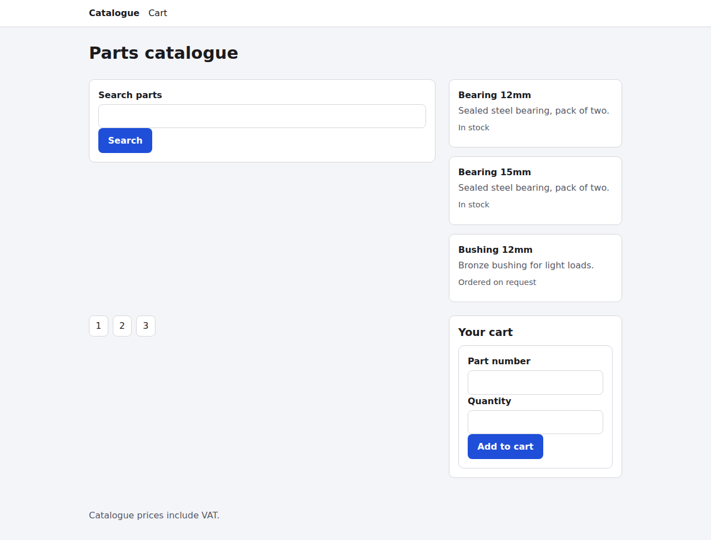
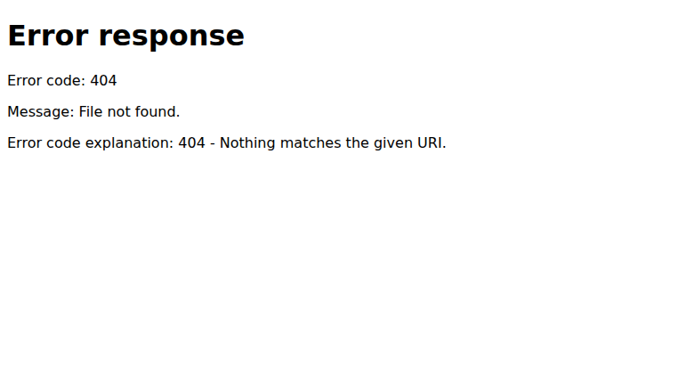
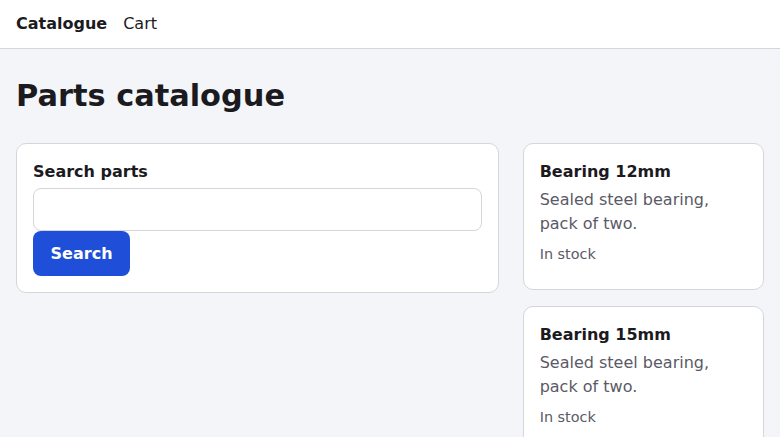
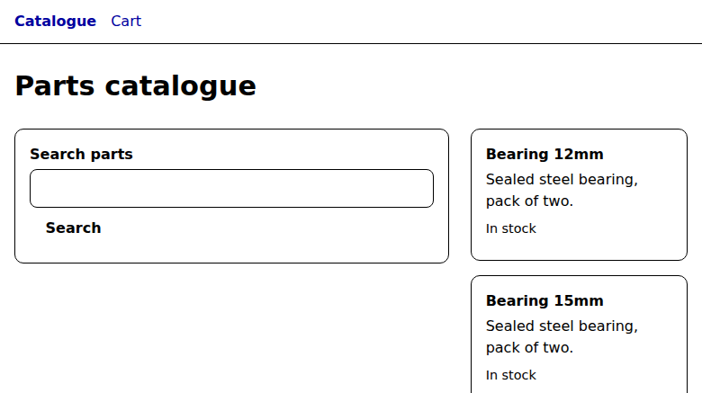

# Web audit: http://127.0.0.1:8765/catalogue/

- **Run:** `2026-10-09T00-27-28-894Z` (report mode, no `web-uplift.json` found)
- **Catalog:** `modern-web-guidance@0.0.193`, principles.json sha256 `5cb6b09a…0fb82b7`
- **Coverage:** 58 / 58 checks judged. 0 blocked, 0 not-run, 0 missing, 0 unknown, 0 duplicates. The validator reports `complete: true`, 0 errors.
- **Outcome:** 20 findings: **1 critical, 1 high, 7 medium, 11 low**. Check outcomes: 21 issues, 28 pass, 9 not-applicable.

## Page profile

This is a static, server-rendered product listing ("Parts catalogue"). It has 51 elements, **0 scripts**, 0 images and one shared 3 KB stylesheet. It contains:

- header nav: **Catalogue** (links to `/`, marked `aria-current=page`) and **Cart** (`/cart`)
- a GET search form (`/search`)
- a "Results" section with three product cards (name, description, availability)
- pagination links 1 to 3 (`/search?page=N`)
- a "Your cart" aside with a POST form that asks for a free-text **Part number** and a **Quantity**

The footer says "Catalogue prices include VAT."

The host is a static Python `http.server` fixture (HTTP/1.0). Server behaviour reflects this host, not necessarily production.

**Coverage decision.** This page is the only one the target exposes, and every link and form on it was followed. Each of these is an audited path: search, pagination, the Cart link, add-to-cart (POST) and the Catalogue link. Product cards have no links, so there are no detail pages to audit; a guessed product URL returns 404. **Not covered:** the sibling directories `account-recovery/`, `booking/`, `contact-lead/` and `event-registration/`. They are separate fixture designs, are not linked from this page, and two of them were audited in earlier runs.

| Path | What | Result |
|---|---|---|
| catalogue-load | Load at the 780px capture and at 1280x900 (full page) | issues |
| catalogue-narrow | 360x800, throttled trace (mobile-lighthouse, 4x CPU) | pass |
| catalogue-preferences | dark scheme, forced colours + more contrast | issues |
| search-flow | GET /search?q=bearing | **failed (404)** |
| pagination | /search?page=2 | **failed (404)** |
| add-to-cart | POST /cart; empty-submit validation; 10x memory cycles | **failed (501)** |
| header-nav | `/` (Catalogue) and `/cart` (Cart) | **failed** (directory listing / 404) |
| catalogue-i18n | ar-EG + Asia/Tokyo render | pass |

## Evidence gathered

These primitives were used: dom; screenshots (default, full page, 1280 full page, 360, dark, forced-colors, plus the destination pages); axe 4.13.0; a11ytree with a real Tab walk; targets; features (live CSSOM); layout at 360; a throttled mobile trace; HAR plus its summary; headers; cookies; trackers; secrets; discoverability (crawler pair); resilience (offline reload); and heap baseline vs after 10x. Two evaluate probes were written for this run: a flow/form/route probe and an ar-EG/Tokyo render. Modern Web Guidance (`forms`, `required-field-feedback`, `color`, `dark-mode`, `agentic-forms`, and others) and the Baseline oracle were also consulted.

| Artifact | Condition | Caption | Findings |
|---|---|---|---|
| [evidence/flow-probe.json](evidence/flow-probe.json) | GET/POST probes | Fields, headings, links, cards, grid placement, route statuses | F1-F10, F15, F18-F20 |
| [evidence/desktop-1280-full.png](evidence/desktop-1280-full.png) | 1280x900 full | Results in narrow column, stranded pagination, no prices | F2-F4, F6 |
| [evidence/desktop.png](evidence/desktop.png) / [desktop-full.png](evidence/desktop-full.png) | default | Load state | F4 |
| [evidence/dark.png](evidence/dark.png) | prefers-color-scheme: dark | Identical to default | F11 |
| [evidence/forced-colors.png](evidence/forced-colors.png) | forced-colors + more contrast | Search button loses its edge | F12 |
| [evidence/narrow-360.png](evidence/narrow-360.png) | 360x800 | Clean single column | - |
| [evidence/after-search.png](evidence/after-search.png) | GET /search?q=bearing | Raw 404 error page | F1, F5 |
| [evidence/catalogue-nav-target.png](evidence/catalogue-nav-target.png) | GET / | Directory listing | F1, F7 |
| [evidence/axe.json](evidence/axe.json) | load | 1 moderate (heading-order), 34 passes | F8 |
| [evidence/a11ytree.json](evidence/a11ytree.json) | load | 10 page Tab stops, all outlined | F7 |
| [evidence/targets.json](evidence/targets.json) | 1280 + 360 | 0/10 under 24px | - |
| [evidence/features.json](evidence/features.json) | load | No color-scheme, :user-invalid, @container, @view-transition | F9, F11, F14 |
| [evidence/layout-360.json](evidence/layout-360.json) | 360x800 | 0 overflow, CLS 0 | - |
| [evidence/trace-mobile-summary.json](evidence/trace-mobile-summary.json) ([trace](evidence/trace-mobile.json)) | 360, mobile-lighthouse, 4x | LCP 529ms, TBT 42ms | - |
| [evidence/page-summary.json](evidence/page-summary.json) ([HAR](evidence/page.har)) | load | 3 req, 5.4 KB, base.css uncompressed/uncached | F17 |
| [evidence/headers.json](evidence/headers.json) | load | HTTP, all security headers missing | F15, F16 |
| [evidence/cookies.json](evidence/cookies.json), [trackers.json](evidence/trackers.json), [secrets.json](evidence/secrets.json) | load | 0 cookies, 0 third parties, 0 secrets | - |
| [evidence/discoverability.json](evidence/discoverability.json) + [rendered](evidence/discoverability-rendered.png)/[crawler](evidence/discoverability-crawler.png) | JS on/off | 100% coverage, no meta description | F18 |
| [evidence/resilience.json](evidence/resilience.json) + [offline.png](evidence/resilience-offline.png) | offline | No SW/manifest; HTTP-cache reload | - |
| [evidence/heap-baseline.json](evidence/heap-baseline.json) / [heap-after-10x.json](evidence/heap-after-10x.json) | before/after 10x | 28.5k -> 30.4k nodes, no Detached* | - |
| [evidence/i18n-ar-EG-tokyo.json](evidence/i18n-ar-EG-tokyo.json) | ar-EG, Asia/Tokyo | Identical text, no locale data | - |

`evidence/after-add-to-cart.png` is a stale capture taken before the POST navigated, so it is **not** evidence; the POST result (501) comes from `flow-probe.json`.

## Findings by principle

### support-core-task-success: issues
- **F1 [critical] Every onward journey dead-ends.** Search returns 404, pages 1-3 return 404, Cart returns 404, Add to cart returns 501, and Catalogue opens a directory listing. A shopper can view three cards and nothing else. *Fix:* implement /search (+?page), /cart, and POST /cart with PRG; point Catalogue at /catalogue/.
  
- **F2 [high] Add to cart needs a part number the page never shows.** The cards have no part number, button or link. *Fix:* add a per-card add form with a hidden part number and quantity=1, and show the part number.
- **F4 [medium] Products are demoted by the grid.** Results sit in the 1fr sidebar column while search takes the 2fr column, and pagination is stranded under search. *Fix:* use explicit `grid-template-areas`.
- **F6 [low] "Your cart" shows no contents or empty state, and nothing confirms an add.**

### be-trustworthy: issues
- **F3 [medium]** No prices anywhere, despite "Catalogue prices include VAT."
- **F9 [medium]** The cart form is submittable empty: no `required`, no default quantity, no `:user-invalid` or inline messages (MWG required-field-feedback).
- **F10 [low]** Part number and search leave autocorrect/autocapitalize/spellcheck on; no `enterkeyhint`.

### be-resilient: issues
- **F5 [medium]** Failures render the bare server "Error response" page with no nav, explanation or retry, and input is lost. Offline/installable is N/A for a server-rendered catalogue site.

### be-inclusive: issues
- **F7 [medium]** `aria-current="page"` sits on links that are not this page (`/` and `/search?page=1`).
- **F8 [low]** The heading outline skips h1 to h3 (axe heading-order); the Results region has no heading.
- **F13 [low]** `body { font: 16px/1.5 }` overrides the user's text size.

### provide-guided-navigation: issues
- directs-attention cites F7 (wrong "you are here" cues) and F4 (pagination detached from results).

### respect-user-preferences: issues
- **F11 [medium]** No dark mode (dark capture identical; no `color-scheme`).
  
- **F12 [low]** Buttons lose their boundary in forced colours (`border: 0`).
  

### be-private-and-secure: issues
- **F15 [medium]** Plain HTTP, no CSP or nosniff, and the state-changing cart POST has no anti-CSRF token.
- **F16 [low]** No HSTS, frame-ancestors/X-Frame-Options, Referrer-Policy or Permissions-Policy.
- Pass: 0 third parties, trackers, cookies or secrets; no permission prompts and no auth surface.

### be-discoverable: issues
- **F18 [low]** The title has no site name; there is no meta description.
- crawlable-and-mobile-friendly cites F1: every followable internal link 404s or opens the directory listing.
- **F19 [low]** Page 1 lives at a second URL with no canonical; no sitemap or robots.txt.
- **F20 [low]** The products have no ItemList/Product JSON-LD and no OG tags.

### be-fast-and-stable: issues
- **F17 [low]** base.css is uncompressed and uncached over HTTP/1.0. CWV are good: LCP 529ms on throttled mobile, CLS 0, TBT 42ms.

### implement-natural-interactions: issues
- **F14 [low]** No cross-document view transitions between result pages. Baseline is *Limited*, so this must be progressive enhancement only.

### Passing or not-applicable principles
- **maximize-content-reduce-noise, adapt-to-the-form-factor, follow-best-practices, be-sustainable, be-memory-efficient:** pass.
- **be-internationalised:** pass. lang/logical layout is fine; locale data and time zones are N/A because no dates or amounts are rendered.
- **be-agent-ready:** not applicable (emerging and contextual). Opportunity: WebMCP-annotate the search and add-to-cart forms once they work.

## Prioritised task list

1. **T1:** Back /search (+?page), /cart and POST /cart (PRG); point Catalogue at /catalogue/ (F1, `forms`)
2. **T2:** Per-card Add to cart with a hidden part number and quantity=1; show part numbers (F2, `forms`)
3. **T3:** Show VAT-inclusive prices or "Price on request" (F3)
4. **T4:** Fix the grid placement with grid-template-areas (F4, `css-layout`)
5. **T5:** Branded error pages with nav, pre-filled search and a way back; failed POSTs keep input + role=alert (F5)
6. **T6:** Cart form: required, default 1, hint/pattern, `:user-invalid` + inline messages (F9, `required-field-feedback`)
7. **T7:** Correct aria-current and unify pagination URLs (F7, F19)
8. **T8:** HTTPS + enforced CSP + nosniff/HSTS/Referrer-/Permissions-Policy; CSRF token (F15, F16, `security`)
9. **T9:** Cart contents / empty state + role=status confirmation (F6)
10. **T10:** Dark mode via `color-scheme` + token overrides (F11, `dark-mode`)
11. **T11:** Results h2 (F8)
12. **T12:** Identifier input hints (F10)
13. **T13:** Title, meta description, JSON-LD, OG, canonical, sitemap (F18, F20, F19)
14. **T14:** Transparent button border for forced colours (F12, `color`)
15. **T15:** Relative body font size (F13)
16. **T16:** Compress and cache base.css; HTTP/2+ (F17)
17. **T17:** Cross-document view transitions behind reduced-motion (F14)

## Skipped / low-confidence notes

- Server-side failures (404/501) and missing headers are properties of the static fixture host. Confidence is medium where production may differ.
- The heap growth (+1.9k nodes) is attributed to harness injection and native validation UI, because the page has no scripts; confidence is medium.
- No checks were blocked or not-run.
