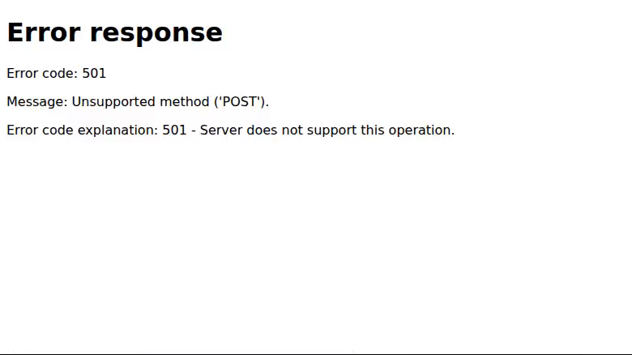
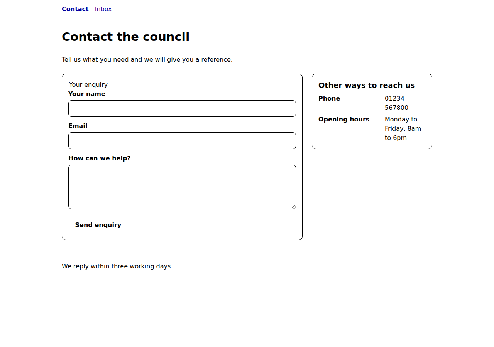
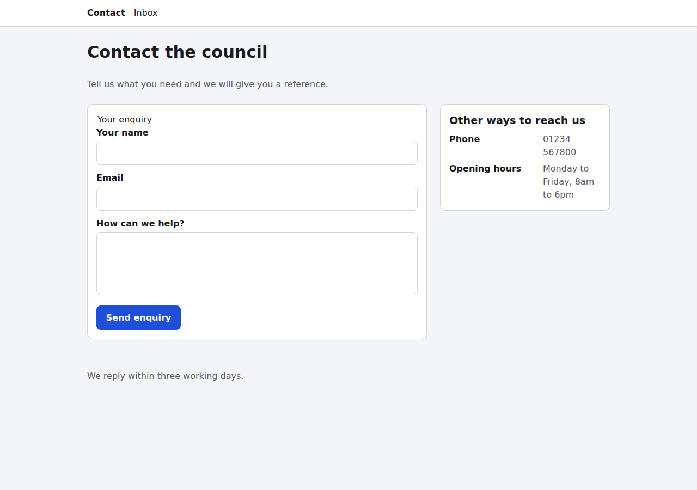

# Web audit: http://127.0.0.1:8765/contact-lead/

- **Run:** 2026-10-09T00-39-23-039Z, report mode, agent: claude
- **Status:** completed. The coverage validator reports 58/58 checks judged, with 0 missing, unknown, duplicate, blocked or not-run.
- **Catalog:** modern-web-guidance@0.0.193 (principles.json sha256 `5cb6b09a…82b7`), Baseline data web-features@3.40.0
- **Config:** no `web-uplift.json` found. Applicability of the contextual principles is my own judgement call.

## Page profile

The target is a static MPA with zero scripts and one shared 3 KB stylesheet, served by a Python `http.server` fixture over HTTP/1.0. It is a council "Contact the council" page:

- a two-link header nav: **Contact** → `/`, marked `aria-current=page`, and **Inbox** → `/inbox`
- an h1, and a lede promising *"we will give you a reference"*
- a POST form `#enquiry-form` → `/enquiry` with required name, email and message fields and a **Send enquiry** button
- an aside, "Other ways to reach us", listing a phone number and opening hours
- a footer: "We reply within three working days."

The target exposes this single template, so the representative set is this page plus its submit journey and its nav targets. Sibling fixture directories (`account-recovery/`, `booking/`, `catalogue/`, `event-registration/`) are not linked from it and are out of scope.

> The host is a static fixture, so server behaviour (the 501 on POST, 404s and missing headers) reflects this deployment, not necessarily production.

## Paths exercised

| Path | What | Result |
|---|---|---|
| contact-load | Page at 780px and 1280x900 (targets at 1280x720) | issues |
| contact-narrow | 360x800, mobile-lighthouse network + 4x CPU trace | pass |
| contact-preferences | prefers-color-scheme: dark; forced-colors + prefers-contrast: more | issues |
| enquiry-submit | Real native submit of a valid enquiry → POST /enquiry; empty, invalid and whitespace-only validation; 10x cycle for the heap | **failed** |
| header-nav | Follow `/` (Contact) and `/inbox` | **failed** |
| contact-i18n | ar-EG locale + Asia/Tokyo time zone | pass |
| contact-offline | Online load, then offline reload | pass |

## Evidence gathered

I used these primitives and tools:
- `dom` and `screenshot` (780, 1280, 360, dark, forced-colors at 780 and 1280, and the nav target)
- `video` of the real submit, plus ffmpeg to extract its final frame
- `evaluate` probes: forms and flows, the aside geometry at 780 and 1280, and the i18n run
- `axe` (4.13.0), `a11ytree` (with the Tab walk), `targets`, `features`
- `layout` at 360, `trace` (throttled mobile), `har`
- `headers`, `cookies`, `trackers`, `secrets`, `discoverability`, `resilience`
- two `heap` snapshots, and the console collector on every run
- Modern Web Guidance `search`/`retrieve`, and the Baseline oracle

The current state, after a valid submission:

## Artifacts

| Type | Path | Shows |
|---|---|---|
| screenshot | [evidence/desktop.png](evidence/desktop.png) | 1280x900; the phone number wraps in the narrow aside |
| screenshot | [evidence/narrow-360.png](evidence/narrow-360.png) | 360x800, single column, no overflow |
| screenshot | [evidence/dark.png](evidence/dark.png) | prefers-color-scheme: dark, identical to light |
| screenshot | [evidence/forced-colors.png](evidence/forced-colors.png) / [evidence/forced-colors-1280.png](evidence/forced-colors-1280.png) | Forced colours; the button loses its boundary |
| video | [evidence/submit.mp4](evidence/submit.mp4) | Real native submit → 501 |
| screenshot | [evidence/after-submit.png](evidence/after-submit.png) | Final frame: "Error response 501" |
| screenshot | [evidence/contact-nav-target.png](evidence/contact-nav-target.png) | Where "Contact" goes: a directory listing |
| other | [evidence/flow-probe.json](evidence/flow-probe.json) | Fields, validation, links, metadata, route fetches |
| other | [evidence/aside-780.json](evidence/aside-780.json), [evidence/aside-1280.json](evidence/aside-1280.json) | dl columns `160px 63px` / `160px 106px` |
| other | [evidence/axe.json](evidence/axe.json) | 0 violations |
| other | [evidence/a11ytree.json](evidence/a11ytree.json) | AX tree + 6-stop Tab order, all with a visible outline |
| other | [evidence/targets.json](evidence/targets.json) | 0 of 5 targets under 24px at both sizes |
| other | [evidence/features.json](evidence/features.json) | CSSOM census (complete) |
| layout | [evidence/layout-360.json](evidence/layout-360.json) | 0 overflow, CLS 0 |
| trace / summary | [evidence/trace-mobile.json](evidence/trace-mobile.json), [evidence/trace-mobile-summary.json](evidence/trace-mobile-summary.json) | LCP 1070 ms, TBT 52 ms (mobile-lighthouse, 4x CPU) |
| har / summary | [evidence/page.har](evidence/page.har), [evidence/page-summary.json](evidence/page-summary.json) | 3 requests, 5 KB; CSS uncompressed and uncached |
| other | [evidence/headers.json](evidence/headers.json) | No security headers; http |
| other | [evidence/cookies.json](evidence/cookies.json), [evidence/trackers.json](evidence/trackers.json), [evidence/secrets.json](evidence/secrets.json) | 0 cookies, 0 third parties, 0 secrets |
| discoverability | [evidence/discoverability.json](evidence/discoverability.json) + [rendered](evidence/discoverability-rendered.png) / [crawler](evidence/discoverability-crawler.png) | 100% coverage without JS |
| other | [evidence/resilience.json](evidence/resilience.json), [evidence/resilience-offline.png](evidence/resilience-offline.png) | No service worker or manifest; offline reload served from the HTTP cache |
| heap | [evidence/heap-baseline.json](evidence/heap-baseline.json), [evidence/heap-after-10x.json](evidence/heap-after-10x.json) | 29.8k → 31.8k nodes; no Detached* |
| other | [evidence/i18n-ar-EG-tokyo.json](evidence/i18n-ar-EG-tokyo.json) | Rendering identical under ar-EG / Tokyo |

## Findings by principle

18 findings: 1 critical, 1 high, 8 medium and 8 low.

### support-core-task-success: issues
- **F1 · critical** (primary-flow-completion): **The enquiry cannot be sent.** A valid native submit to `POST /enquiry` returns *501 Unsupported method*. Evidence: [submit.mp4](evidence/submit.mp4), [after-submit.png](evidence/after-submit.png), and the flow-probe `POST /enquiry → 501`.
  **Fix:** add a real handler with server-side validation, then a 303 redirect to a confirmation page. *(forms)*
- **F2 · high** (clear-system-state-and-recovery): The lede promises a reference, but no success state exists: no confirmation route, no live region, no reference. **Fix:** a confirmation page with the reference number, the reply expectation and a focus or `role=status` announcement. *(accessible-error-announcement)*

### be-resilient: issues
- **F3 · medium** (network-and-http-failure-states): Failures render the server's bare error template, with no header, no explanation, no retry and no way back to the form or the phone number. **Fix:** branded 4xx/5xx pages; on a failed POST, re-render the form with the values kept. *(persistent-toast-notifications)*

### provide-guided-navigation: issues
- **F4 · medium** (directs-attention): "Contact" is announced as the current page but links to `/`, a directory listing ([contact-nav-target.png](evidence/contact-nav-target.png)), and "Inbox" returns 404. **Fix:** point Contact at `/contact-lead/` and build or remove Inbox. *(accessibility)*

### respect-user-preferences: issues
- **F5 · medium** (respects-contrast): Under forced colours, **Send enquiry** becomes bare text, because it has `border: 0` ([forced-colors-1280.png](evidence/forced-colors-1280.png)). **Fix:** `border: 2px solid transparent`. *(color)*

  
- **F6 · medium** (respects-color-scheme): There is no dark mode ([dark.png](evidence/dark.png)), and the census finds 0 `color-scheme` and 0 `light-dark()`. **Fix:** `color-scheme: light dark` plus `light-dark()` tokens. light-dark() is Baseline *newly*, so the fallback is **mandatory**. *(dark-mode)*

### adapt-to-the-form-factor: issues
- **F7 · medium** (component-level-responsiveness): The aside's `dl` has a fixed 160px term column. At 780px it leaves 63px for values, so the opening hours take 5 lines; the phone number wraps even at 1280px. There are 0 `@container` rules. **Fix:** make the aside a container with `max-content 1fr` columns and stack the dl when narrow. Container queries are Baseline *widely*. *(size-aware-styling)*

  
- **F18 · low** (input-modality-aware): The phone number is not a `tel:` link, so it cannot be tapped to call on mobile. *(accessibility)*

### be-trustworthy: issues
- **F8 · medium** (humane-error-handling): Validation relies only on the browser's transient bubbles. There is no inline error text, no `:user-invalid` styling and no `aria-invalid`, and a whitespace-only message passes `required`. **Fix:** per-field error text shown with `:user-invalid` (Baseline *widely*), aria-invalid sync, and `minlength`. *(required-field-feedback)*
- **F11 · low** (safe-commercial-and-account-flows): Personal data is collected without a privacy notice at the point of collection. *(privacy)*

### be-private-and-secure: issues
- **F9 · medium** (secure-transport-and-headers): The form posts name, email and message over `http:`, with no CSP and no CSRF token. Confidence is medium, because production may terminate TLS in front of this fixture. *(security)*
- **F10 · medium** (defensive-browser-policies): There is no HSTS, no frame-ancestors or XFO, no nosniff, no Referrer-Policy and no Permissions-Policy. *(security)*

### be-inclusive: issues
- **F12 · low** (legible-text): `body { font: 16px … }` pins the text size in px, overriding the user's default. *(respect-os-text-scale)*

### be-fast-and-stable: issues
- **F13 · low** (efficient-resource-delivery): `base.css` is served uncompressed, with no cache headers, over HTTP/1.0. Absolute cost is tiny: LCP is 1070 ms throttled, CLS 0 and TBT 52 ms. *(performance)*

### be-discoverable: issues
- **F14 · low** (title-and-description): No meta description, and the title "Contact the council" does not name the council.
- **F15 · low** (canonical-and-indexing-signals): No canonical; robots.txt and sitemap.xml both return 404.
- **F16 · low** (structured-and-shareable-metadata): No GovernmentOrganization/ContactPoint JSON-LD for the phone number and hours, and no OG tags.

### implement-natural-interactions: issues
- **F17 · low** (view-transitions): Hard cuts between pages. Opt in with `@view-transition { navigation: auto; }`. This is Baseline *limited*, so it can only be a progressive enhancement. *(cross-document-transitions)*

### Pass / not-applicable
- **pass:**
  - maximize-content-reduce-noise
  - follow-best-practices: the only console error is Chrome's automatic favicon 404
  - be-internationalised: lang is correct; the locale and time-zone checks are N/A because nothing is formatted by code and the ar-EG/Tokyo render is identical
  - be-sustainable: 5 KB total and no third parties; optimised-assets is N/A because there are no images
  - be-memory-efficient
- **not-applicable:** be-agent-ready, which is emerging, has no declared intent, and has no agent-facing surface. Once the endpoint works, annotating `#enquiry-form` for agents (*agentic-forms*) is an opportunity.
- **Check-level N/A with rationale:**
  - scroll-driven-animations, physical-gestures, scroll-state-aware-chrome, anchored-positioning and semantic-dismissible-primitives: there is no such UI on the page.
  - in-context-permissions-and-modern-auth: the form is anonymous and has no auth.
  - resilient-runtime-behaviour: there is no runtime code.
  - offline-and-installable: a one-shot contact page is not an app, and sending an enquiry needs the network anyway.

## Prioritised task list

1. **T1:** Make `POST /enquiry` work, with a 303 redirect to a confirmation page (F1).
2. **T2:** Build the success state, showing the promised reference (F2).
3. **T3:** Branded error pages, and keep the user's values on a failed POST (F3).
4. **T4:** Fix the header nav targets and `aria-current` (F4).
5. **T5:** HTTPS, CSP, CSRF protection and the defensive headers (F9, F10).
6. **T6:** Inline validation with `:user-invalid` and aria-invalid (F8).
7. **T7:** Give the button a transparent border for forced colours (F5).
8. **T8:** Make the aside a container, and add a `tel:` link (F7, F18).
9. **T9:** Dark mode, with a fallback (F6).
10. **T10:** Privacy notice line (F11).
11. **T11:** Title and description, canonical, robots.txt and sitemap, JSON-LD and OG (F14–F16).
12. **T12:** Relative body font size (F12).
13. **T13:** Compress and long-cache the CSS (F13).
14. **T14:** Cross-document view transitions (F17).

## Skipped / low-confidence

- **F9:** I can't tell from here whether production adds TLS or headers in front of this fixture.
- **no-leak-under-repeated-interaction:** judged on a static page whose only interaction is filling the form; the 97 KB heap delta is attributable to the injected probe script.
- **F17:** subjective for a two-page flow.
- **Lighthouse:** not run. The first-party trace, layout, axe and HAR evidence covers the same signals.
- **Stray screenshot:** an earlier `after-submit.png` capture (taken before navigation completed) was overwritten by the extracted video frame.
