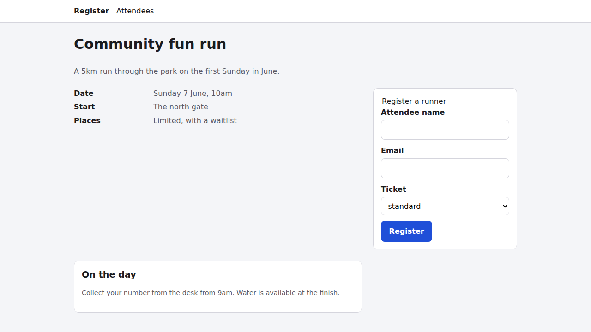
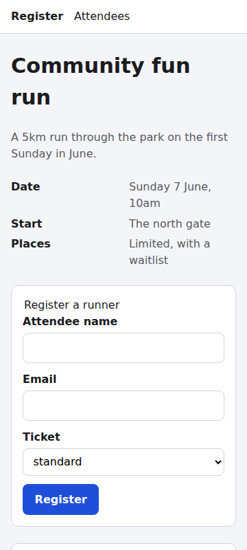
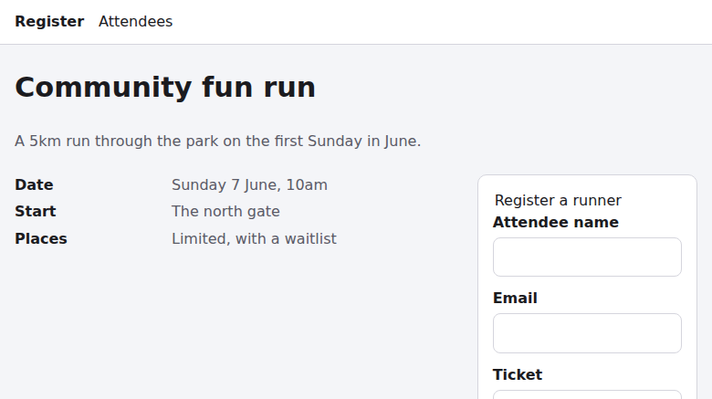

# Web audit: Community fun run registration

- **URL:** http://127.0.0.1:8765/event-registration/
- **Run:** 2026-10-09T00-51-22-040Z, report mode (critique only)
- **Coverage:** 58/58 checks judged (30 pass, 20 issues, 8 not-applicable), 0 blocked, 0 not-run, 0 missing/unknown/duplicate. **Status: completed.**
- **Config:** no `web-uplift.json` found
- **Catalog:** modern-web-guidance@0.0.193, principles sha256:5cb6b09a…82b7, Baseline web-features@3.40.0

## Validator output

```
{ "expected": 58, "recorded": 58, "judged": 58, "blocked": 0, "notRun": 0,
  "missing": 0, "unknown": 0, "duplicates": 0, "complete": true, "errors": 0 }
```

## Page profile

A single static MPA page with no JavaScript (0 scripts) and 44 DOM elements. It has an h1, an event-details `<dl>`, a native POST form (attendee name, email, ticket select), an "On the day" aside and a footer. Load is 3 requests and 5.4 KB, all first-party. The host behaves like a static file server: `/` is a directory listing, unknown paths return 404, and POST returns 501.

**Coverage decision.** This is a single page, and I judged it as one. The only linked surfaces are `/` (a directory listing of other, unrelated fixtures such as `account-recovery/` and `booking/`, which are out of scope), `/attendees` (404) and the form action `/register` (501 on POST). I probed all three, and their failures are findings.

| Path | What | Conditions | Result |
|---|---|---|---|
| P1-entry | Registration page | default 780 px, 1280x720 | issues |
| P2-mobile | Same page, narrow + throttled | 360x800, mobile-lighthouse + 4x CPU | pass |
| P3-register-flow | Fill + submit, empty submit, bad email | POST to form action | **failed** |
| P4-nav-and-routes | Nav targets, robots.txt, sitemap.xml | fetch | issues |
| P5-preferences | Dark, forced colours, reduced motion, more contrast | emulated media | issues |
| P6-locale | Second locale and zone | ar-EG, Asia/Tokyo | issues |
| P7-offline | Real offline reload | offline | pass |

## Evidence gathered

dom · screenshots (light, dark, 360, forced-colors, 1280) · axe-core 4.13.0 · a11ytree + real Tab walk · targets (1280 + 360) · features (live CSSOM, complete) · layout (360) · throttled mobile trace · HAR + summary · headers · cookies · trackers · secrets · discoverability (raw vs rendered) · resilience (offline reload) · console · heap (baseline vs 10x form cycle) · evaluate probes (routes, form POST + validation + metadata, locale/zone, motion/contrast/font, contrast ratios) · Modern Web Guidance retrieve/search · Baseline oracle.

| Artifact | Type | Condition | Findings |
|---|---|---|---|
| [evidence/desktop.png](evidence/desktop.png) | screenshot | default | |
| [evidence/desktop-1280-full.png](evidence/desktop-1280-full.png) | screenshot | 1280x720 | F03, F19 |
| [evidence/dark.png](evidence/dark.png) | screenshot | prefers-color-scheme: dark | F05 |
| [evidence/narrow-360.png](evidence/narrow-360.png) | screenshot | 360x800 | |
| [evidence/forced-colors.png](evidence/forced-colors.png) | screenshot | forced-colors: active | |
| [evidence/discoverability-crawler.png](evidence/discoverability-crawler.png) | screenshot | JS disabled | |
| [evidence/resilience-offline.png](evidence/resilience-offline.png) | screenshot | offline | |
| [evidence/form-probe.json](evidence/form-probe.json) | probe | POST /register, validation, metadata | F01–F04, F11, F13, F17–F20 |
| [evidence/routes-probe.json](evidence/routes-probe.json) | probe | fetch | F02, F04, F12 |
| [evidence/contrast-probe.json](evidence/contrast-probe.json) | probe | computed colours | F07 |
| [evidence/motion-contrast-probe.json](evidence/motion-contrast-probe.json) | probe | reduced-motion + more contrast | F06, F08, F09 |
| [evidence/headers.json](evidence/headers.json) | headers | | F14, F15 |
| [evidence/page-summary.json](evidence/page-summary.json) · [page.har](evidence/page.har) | HAR | | F16 |
| [evidence/trace-mobile-summary.json](evidence/trace-mobile-summary.json) · [trace](evidence/trace-mobile.json) | trace | 360x800, mobile-lighthouse, 4x CPU | |
| [evidence/layout-360.json](evidence/layout-360.json) | layout | 360x800 | |
| [evidence/axe.json](evidence/axe.json) · [a11ytree.json](evidence/a11ytree.json) · [targets.json](evidence/targets.json) · [features.json](evidence/features.json) | a11y / CSS | | |
| [evidence/discoverability.json](evidence/discoverability.json) · [resilience.json](evidence/resilience.json) | | | F11 |
| [evidence/heap-baseline.json](evidence/heap-baseline.json) · [heap-after-10x.json](evidence/heap-after-10x.json) | heap | 10x form cycle | |
| [evidence/i18n-ar-EG-tokyo.json](evidence/i18n-ar-EG-tokyo.json) | probe | ar-EG, Asia/Tokyo | F20 |
| [evidence/cookies.json](evidence/cookies.json) · [trackers.json](evidence/trackers.json) · [secrets.json](evidence/secrets.json) · [console.json](evidence/console.json) | | | |




## Findings by principle

Severity totals: **1 critical, 2 high, 9 medium, 8 low** (20 findings).

### support-core-task-success: issues
- **F01 · critical · primary-flow-completion.** You cannot register. Submitting the form's own data to its action (`POST /register`) returns **501 Unsupported method ('POST')**, and a GET to the same URL returns 404. The host looks like a static file server, so this may be an environment limitation, but as served the core task dead-ends. *Fix:* handle POST /register and use Post/Redirect/Get to reach a confirmation page. Keep the native form so it still works without JS. (guide: `forms`)
- **F03 · medium · clear-system-state-and-recovery.** "Places: Limited, with a waitlist" never says whether places remain, so "Register" might book a place or join the waitlist. *Fix:* render "N places left" or "Full – join waitlist", and make the button text and the confirmation copy match.

### be-resilient: issues (offline/installable judged not-applicable)
- **F02 · high · network-and-http-failure-states.** The 501 and 404 responses are bare server "Error response" documents with no nav, no explanation and no way back, and the user's form entry is lost. *Fix:* serve branded error pages, and on failure re-render the form with the entered values and an announced error summary. (guide: `persistent-toast-notifications`)

### provide-guided-navigation: issues
- **F04 · high · directs-attention.** The nav link "Register" has `aria-current="page"` but points to `/` (a directory listing), while the user is on `/event-registration/`. "Attendees" goes to `/attendees`, which returns 404. *Fix:* point Register at the real page, and publish or remove Attendees. (guide: `accessibility`)

### respect-user-preferences: issues
- **F05 · medium · respects-color-scheme.** There is no dark mode: the dark screenshot is byte-identical to the light one, and the page has no `color-scheme`, `light-dark()` or `prefers-color-scheme`. *Fix:* set `color-scheme: light dark`, add the meta tag, and give dark values to the existing tokens. The `prefers-color-scheme` media-query fallback is mandatory because `light-dark()` is Baseline *newly*. (guide: `dark-mode`)
  
- **F06 · low · respects-contrast.** Forced colors works, but under `prefers-contrast: more` the control borders stay at 1.46:1. *Fix:* override `--line` and `--muted` inside `@media (prefers-contrast: more)`.

### be-inclusive: issues
- **F07 · medium · sufficient-contrast.** Input and select borders measure **1.46:1** against the white card, below the WCAG 1.4.11 minimum of 3:1, and axe does not test this. All text passes (6.2–6.8:1). *Fix:* add a darker control-border token (≈ #767680). (guide: `contrast-color`, `forms`)
- **F08 · low · structure-and-focus.** There is no skip link. Landmarks, headings, tab order and the visible 3 px focus ring are all good.
- **F09 · low · legible-text.** `body { font: 16px … }` overrides the user's default font size. *Fix:* use `1rem`, and optionally add `<meta name="text-scale" content="scale">`. (guide: `respect-os-text-scale`)

### be-trustworthy: issues
- **F17 · medium · humane-error-handling.** Required fields aren't marked, there is no `:user-invalid` styling and no inline or `aria-invalid` errors; only the transient native validation bubble appears. *Fix:* follow `required-field-feedback`. `:user-invalid` is Baseline *widely*.
- **F19 · medium · safe-commercial-and-account-flows.** Ticket tiers (standard, accessible, student) show no price, eligibility or explanation, and there's no cancellation information. *Fix:* show prices and terms; radios suit three options.
- **F18 · low · trustworthy-input-assistance.** `#name` has no `autocomplete="name"`. The email field is correct.

### be-discoverable: issues
- **F11 · medium · title-and-description.** There is no meta description. The title is good.
- **F13 · medium · structured-and-shareable-metadata.** The page describes an event but has no schema.org Event JSON-LD and no Open Graph tags.
- **F12 · low · canonical-and-indexing-signals.** No canonical link, robots.txt or sitemap, and `/` is a raw directory listing.

### be-private-and-secure: issues
- **F14 · medium · secure-transport-and-headers.** Served over plain HTTP with no CSP and no nosniff, while the form collects name and email. Confidence is medium because loopback counts as a secure context. (guide: `security`)
- **F15 · medium · defensive-browser-policies.** No HSTS, no clickjacking protection (frame-ancestors or X-Frame-Options), and no Referrer-Policy or Permissions-Policy.

### be-fast-and-stable: issues
- **F16 · low · efficient-resource-delivery.** The only render-blocking resource, `base.css`, is served uncompressed and without cache headers. The real impact is small: on throttled mobile, LCP is 611 ms and CLS is 0.

### implement-natural-interactions: issues
- **F10 · low · view-transitions.** The MPA doesn't opt into cross-document view transitions. That feature is Baseline *limited*, so it's a progressive enhancement and should be gated by reduced motion.

### be-internationalised: issues
- **F20 · low · locale-aware-data.** "Sunday 7 June, 10am" has no year and no `<time datetime>`. That date fell in 2026 and has passed as of this audit (the next first Sunday in June is 6 June 2027).

### Passing and not-applicable
- **maximize-content-reduce-noise, adapt-to-the-form-factor, follow-best-practices, be-sustainable, be-memory-efficient:** pass. No overlays, 0 px overflow at 360, every target ≥ 24 px, no console errors (only Chrome's automatic favicon 404), 5.4 KB with no third parties, and no detached DOM after 10 form cycles.
- **be-agent-ready:** not-applicable. There's no agent intent, and the labelled native form is already machine-operable. Opportunity: `agentic-forms`.
- **Not-applicable checks (8, each with its own rationale in report.json):** scroll-driven-animations, physical-gestures, scroll-state-aware-chrome, anchored-positioning, resilient-runtime-behaviour, offline-and-installable, structured-agent-capabilities, on-device-inference.

## Prioritised task list

1. **T1** Make POST /register work, with a PRG confirmation stating place vs waitlist (F01, F03), `forms`
2. **T2** Branded error pages, and keep form values on failure (F02), `persistent-toast-notifications`
3. **T3** Fix the nav targets and `aria-current` (F04), `accessibility`
4. **T4** Required markers, `:user-invalid` inline errors with `aria-invalid`, and `autocomplete=name` (F17, F18), `required-field-feedback`
5. **T5** Control-border contrast ≥ 3:1 and `prefers-contrast` overrides (F07, F06), `contrast-color`
6. **T6** Ticket prices, eligibility and cancellation terms (F19), `forms`
7. **T7** HTTPS and security headers (F14, F15), `security`
8. **T8** Meta description, JSON-LD Event, OG, canonical, robots/sitemap, and `<time>` with a year (F11, F13, F12, F20), `html`
9. **T9** Dark mode (F05), `dark-mode`
10. **T10** rem body font and a skip link (F09, F08), `respect-os-text-scale`
11. **T11** Cache and compress base.css (F16), `optimize-preload-priority`
12. **T12** Cross-document view transitions (F10), `cross-document-transitions`

## Low-confidence and caveats

- **F01 and F02 may be an artefact of the hosting.** The 501 is the response of a static file server. The finding records what users of this origin experience, and fixing it may mean deploying a real handler.
- **TBT is 256 ms on throttled mobile even though the page has no scripts.** I attributed it to parse, style and layout under 4x CPU slowdown, not page code, so good-core-web-vitals passes with medium confidence.
- **The heap grew by about 98 KB after 10 cycles.** I attribute this to V8 compiling the injected probe script: the page has no scripts or listeners, and there are no Detached* constructors.
- **Screenshot-with-interact didn't capture the post-submit navigation** (`after-*-submit.png` are identical to the baseline). The POST outcome is taken from the direct fetch probe instead.
